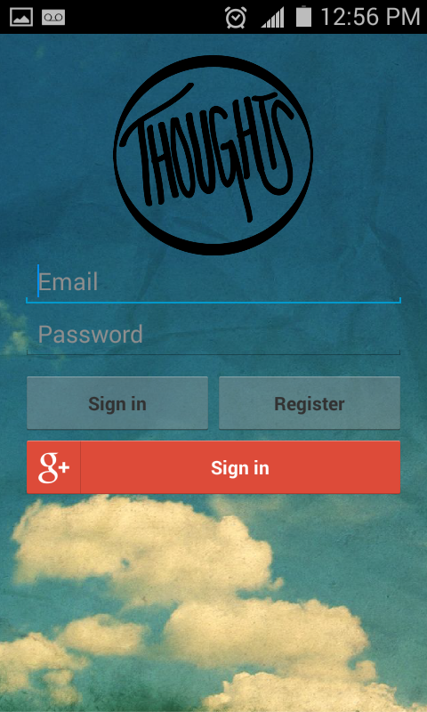

# Thoughts

Thoughts is a personal sentiment tracking and analysis application for Android that enables users to track mood and emotional state. The primary function of the application pertains to the use of sentiment analysis to classify user <i>thoughts</i>, which like posts in a blog, are simply text input by the user throughout time. As the application collects these thoughts from the user, it is able to analyze the user’s thoughts for positivity/negativity and affective/emotional state. In this way, the application is able to track the user’s mood and present its findings to the user.

